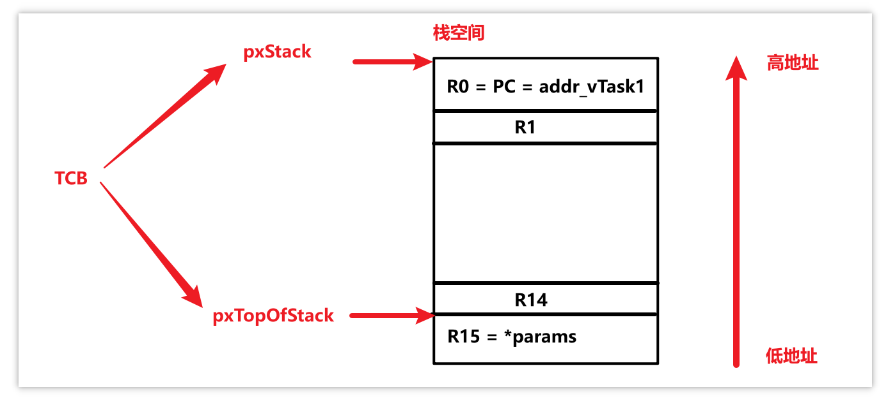

# 05_创建任务的内部细节


1. TCB 结构体主要内容

   ```c
   typedef struct tskTaskControlBlock       /* The old naming convention is used to prevent breaking kernel aware debuggers. */
   {
       volatile StackType_t * pxTopOfStack; /*< Points to the location of the last item placed on the tasks stack.  THIS MUST BE THE FIRST MEMBER OF THE TCB STRUCT. */
       ListItem_t xStateListItem;                  /*< The list that the state list item of a task is reference from denotes the state of that task (Ready, Blocked, Suspended ). */
       ListItem_t xEventListItem;                  /*< Used to reference a task from an event list. */
       UBaseType_t uxPriority;                     /*< The priority of the task.  0 is the lowest priority. */
       StackType_t * pxStack;                      /*< Points to the start of the stack. */
       char pcTaskName[ configMAX_TASK_NAME_LEN ]; /*< Descriptive name given to the task when created.  Facilitates debugging only. */ /*lint !e971 Unqualified char types are allowed for strings and single characters only. */
   } tskTCB;
   ```

2. 创建任务时，任务的栈从哪里分配？大小怎么确定？

   - **栈从内存空间中分配**

     例如 [heap_4.c](source/11_freertos_example_scheduler/FreeRTOS/Source/portable/MemMang/heap_4.c) 算法就是定义了一个大数组，使用 heap_4 算法管理堆栈空间时，会从这个大数组中分配出栈

     ```c
     /* Allocate the memory for the heap. */
     #if ( configAPPLICATION_ALLOCATED_HEAP == 1 )
     
     /* The application writer has already defined the array used for the RTOS
     * heap - probably so it can be placed in a special segment or address. */
         extern uint8_t ucHeap[ configTOTAL_HEAP_SIZE ];
     #else
         PRIVILEGED_DATA static uint8_t ucHeap[ configTOTAL_HEAP_SIZE ];
     #endif /* configAPPLICATION_ALLOCATED_HEAP */
     ```

   - **栈的大小由局部变量占用的空间、函数调用深度决定**，分配任务栈空间时，可以先粗略估算局部变量占用的空间，然后再分配
     - 例如，任务函数中的局部变量占据 100 字节，可以先粗略分配 200 字节的栈，然后再慢慢调整减小，节省空间

3. 任务是怎么保存/恢复现场的？

   以 [main.c](source/11_freertos_example_scheduler/FreeRTOS/Demo/CORTEX_STM32F103_Keil/main.c) 中创建的 `Task 1` 任务为例：

   ```c
   int main( void )
   {
   	prvSetupHardware();
   	
   	xTaskCreate(vTask1, "Task 1", 1000, NULL, 0, NULL);  
   	xTaskCreate(vTask2, "Task 2", 1000, NULL, 0, NULL);
   	xTaskCreate(vTask3, "Task 3", 1000, NULL, 2, NULL);
   
   	/* 启动调度器 */
   	vTaskStartScheduler();
   
   	/* 如果程序运行到了这里就表示出错了, 一般是内存不足 */
   	return 0;
   }
   ```

   `xTaskCreate` 函数参数解释：

   ```c
       /* vTask1   -- 任务函数指针，指向的函数即该任务具体执行的代码
        * "Task 1" -- 该任务的名称（不重要）
        * 1000		-- 为该任务分配的栈空间为 1000 word = 1000 * 4 byte
        * NULL		-- 向任务函数 vTask1 传入的参数的指针，此处为 NULL（无传参）
        * 0		-- 该任务的优先级，数字越大优先级越高
        * NULL		-- 该任务的句柄，即 TCB 结构体
        */	
       xTaskCreate(vTask1, "Task 1", 1000, NULL, 0, NULL);  
   ```

   `xTaskCreate` 函数原型分析：

   [参考：【FreeRTOS】栈生长方向 portSTACK_GROWTH_freertos的栈是向上生长还是向下生长-CSDN博客](https://blog.csdn.net/csdndulala/article/details/126301430)

   [参考：tskSTATIC_AND_DYNAMIC_ALLOCATION_POSSIBLE - CSDN文库](https://wenku.csdn.net/answer/7mqq6o8aqo)

   ```c
   	/* xTaskCreate 函数原型 */
       BaseType_t xTaskCreate( TaskFunction_t pxTaskCode,
                               const char * const pcName, 
                               const configSTACK_DEPTH_TYPE usStackDepth,
                               void * const pvParameters,
                               UBaseType_t uxPriority,
                               TaskHandle_t * const pxCreatedTask )
       {
           TCB_t * pxNewTCB;    // TCB 任务控制块
           BaseType_t xReturn;  // 返回值
   
           /* portSTACK_GROWTH > 0，栈向上生长；反之向下生长
            * 创建任务时，要为 TCB 和 STACK 分配空间，TCB 和 STACK 谁在高地址、谁在低地址与栈生长方向相关
            * 空间分配原则：谁先申请，谁在低地址
            */ 
           #if ( portSTACK_GROWTH > 0 )
               {
                   /* 栈向上生长（由低地址向高地址生长）时，要先申请 TCB 的空间，再申请 STACK 的空间，
                    * 让 TCB 的空间在 STACK 的下方，否则 STACK 在生长过程中可能会覆盖到 TCB 的空间
                    */
                   pxNewTCB = ( TCB_t * ) pvPortMalloc( sizeof( TCB_t ) );
   
                   if( pxNewTCB != NULL )
                   {
                       pxNewTCB->pxStack = ( StackType_t * ) pvPortMalloc( ( ( ( size_t ) usStackDepth ) * sizeof( StackType_t ) ) ); /*lint !e961 MISRA exception as the casts are only redundant for some ports. */
   
                       if( pxNewTCB->pxStack == NULL )
                       {
                           vPortFree( pxNewTCB );
                           pxNewTCB = NULL;
                       }
                   }
               }
           #else /* portSTACK_GROWTH */
               {
                   StackType_t * pxStack;
   
                   /* 栈向下生长（由高地址向低地址生长）时，要先申请 STACK 的空间，再申请 TCB 的空间，
                    * 让 TCB 的空间在 STACK 的上方，否则 STACK 在生长过程中可能会覆盖到 TCB 的空间
                    */
                   pxStack = pvPortMalloc( ( ( ( size_t ) usStackDepth ) * sizeof( StackType_t ) ) ); /*lint !e9079 All values returned by pvPortMalloc() have at least the alignment required by the MCU's stack and this allocation is the stack. */
   
                   if( pxStack != NULL )
                   {
                       pxNewTCB = ( TCB_t * ) pvPortMalloc( sizeof( TCB_t ) ); /*lint !e9087 !e9079 All values returned by pvPortMalloc() have at least the alignment required by the MCU's stack, and the first member of TCB_t is always a pointer to the task's stack. */
   
                       if( pxNewTCB != NULL )
                       {
                           pxNewTCB->pxStack = pxStack;
                       }
                       else
                       {
                           vPortFree( pxStack );
                       }
                   }
                   else
                   {
                       pxNewTCB = NULL;
                   }
               }
           #endif /* portSTACK_GROWTH */
   
           if( pxNewTCB != NULL )
           {
               #if ( tskSTATIC_AND_DYNAMIC_ALLOCATION_POSSIBLE != 0 ) 
                   {
                       /* Tasks can be created statically or dynamically, so note this
                        * task was created dynamically in case it is later deleted. */
                       pxNewTCB->ucStaticallyAllocated = tskDYNAMICALLY_ALLOCATED_STACK_AND_TCB;
                   }
               #endif /* tskSTATIC_AND_DYNAMIC_ALLOCATION_POSSIBLE */
   
               prvInitialiseNewTask( pxTaskCode, pcName, ( uint32_t ) usStackDepth, pvParameters, uxPriority, pxCreatedTask, pxNewTCB, NULL );
               prvAddNewTaskToReadyList( pxNewTCB );
               xReturn = pdPASS;  // 正确返回，分配成功
               
           }
           else
           {
               xReturn = errCOULD_NOT_ALLOCATE_REQUIRED_MEMORY;  // 错误返回，分配不成功
           }
   
           return xReturn;
       }
   ```

   特别关注该任务的 TCB，简化后的内容： 

   ```c
   typedef struct tskTaskControlBlock       /* The old naming convention is used to prevent breaking kernel aware debuggers. */
   {
       volatile StackType_t * pxTopOfStack;        /* 栈的尾部 */
       ListItem_t xStateListItem;                  
       ListItem_t xEventListItem;                  
       UBaseType_t uxPriority;                     /* 任务优先级 */
       StackType_t * pxStack;                      /* 栈的起始位置 */
       char pcTaskName[ configMAX_TASK_NAME_LEN ]; /* 任务名称 */
   } tskTCB;
   ```

   假设 `Task 1` 在被创建时为暂停态，那么在创建的瞬间就要将该任务函数中所有寄存器的值都保存起来（保存现场）：

   - `vTask1` 是任务函数的地址，保存在 `PC` 寄存器（即 `R15` 寄存器）
   - `vTask1` 的参数地址保存在 `R0` 寄存器（约定俗成），在该例子中参数地址为 `NULL`
   - `R15` 到 `R0` 一共 16 个寄存器的值保存到栈里，高标号的寄存器保存在高地址，低标号的寄存器保存在低地址，先将 `R15` 的值保存到 TCB 中 `pxStack` 所指向的内存地址（栈的起始位置），最后将 `R0` 的值保存在 `pxTopOfStack`（栈的末尾位置）

   

   这样就可以通过该任务的 TCB 找到其栈位置并恢复现场。


## 总结

FreeRTOS 创建任务时：

- 分配了该任务的 TCB 结构体
- 分配了该任务的栈
- TCB 结构体中，记录了栈的位置（`pxStack`），栈里保存有任务函数的地址、参数、局部变量等（现场）

