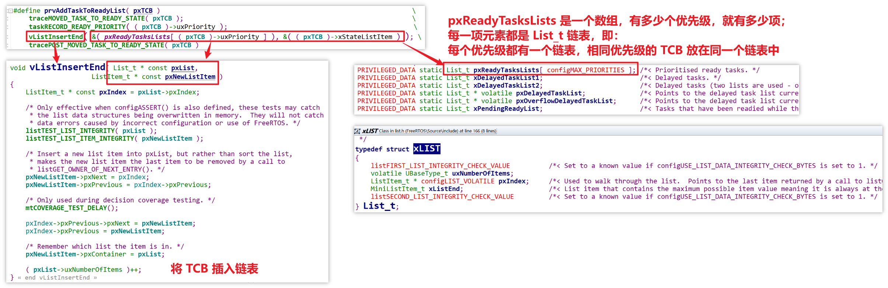
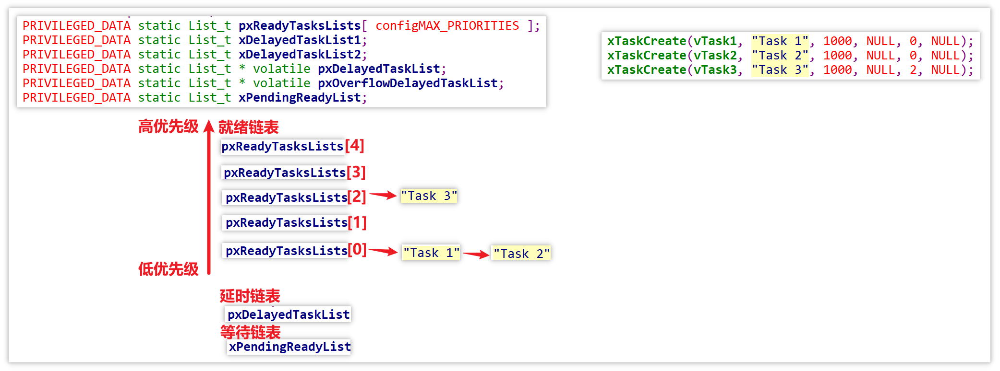

# 06_任务的调度机制

1. 任务的优先级
   - 高优先级的任务可以抢占低优先级的任务
   - 高优先级的任务不停止，低优先级的任务永远无法执行
   - 相同优先级的任务轮流执行（**时间片轮转**）

2. 任务的 4 种状态：[FreeRTOS学习笔记：FreeRTOS如何入门？任务就绪态、阻塞态、挂起态，傻傻分不清？_低优先级任务不被饿死-CSDN博客](https://blog.csdn.net/weixin_44578655/article/details/104547355)
   - 运行态：running
   - 就绪态：ready
   - 阻塞态：blocked，等待某个时间、事件
   - 暂停态：suspend，可能永远都不会再执行

3. 怎么管理任务？
   - 从运行态/就绪态找出最高优先级的任务，运行它
   - 一旦有更高优先级的任务，马上抢占
   - 如果有多个平级且最高优先级的任务，轮流运行：
     - 排队，链表最前面的任务运行 1 个 Tick 后，又排到链表尾部

4. 任务调度在代码中具体是如何实现的？

   首先在创建任务的时候，`xTaskCreate` 会创建一个 TCB 结构体（`pxNewTCB`），成功为该任务的 TCB 和 STACK 分配空间后，就会将 TCB 放入就绪链表中：

   

   具体操作就是根据该任务的优先级，将其 TCB 插入数组 `pxReadyTaskLists` 中的某一项链表元素中：

   - `pxReadyTaskLists` 是以链表为元素的数组，元素个数为设定的优先级个数（通过 `configMAX_PRIORITIES` 配置），元素的下标与优先级对应
   - 假设该任务的优先级为 0，就将其 TCB 插入 `pxReadyTaskLists[0]` 这个链表中，具体代码如下图

   

   另外还注意到：

   - 创建任务时，任务句柄 `pxCreatedTask` 是出参，其类型实际上也是 TCB
   - 当该任务的 TCB 和 STACK 都成功分配到空间后，`xTaskCreate` 函数会调用 `prvInitialiseNewTask` 函数做一些初始化，当一切都顺利时，就会将 TCB 赋值给任务句柄，之后就可以通过任务句柄来操作该任务

   

   同时，还有 `DelayTaskList` 和 `PendingReadyList` 这两个链表值得关注。

   在创建了下图这三个任务后，其 TCB 就会放入就绪链表中：

   - 任务调度器会从上往下寻找任务，找到最高优先级的就绪链表，将其中的任务调度出来运行
   - 在下图中，假设 Task3 没有被休眠、暂停，Task3 就会一直运行（优先级最高，且没有同等优先级的其它任务）
   - 假设没有 Task3 这个任务，Task1 和 Task2 会轮流运行 1 个 Tick，流程如下：
     - Task1 运行一个 Tick，然后放到其所在链表的尾部，此时链表的头部是 Task2
     - Task2 运行一个 Tick，然后放到其所在链表的尾部，此时链表的头部是 Task1
     - Task1 运行一个 Tick，然后放到其所在链表的尾部，此时链表的头部是 Task2
     - ......

   

5. 谁进行上述调度？**Tick 中断**

   - 在 FreeRTOS 中，每个 TickCount 的间隔一般为 1ms

   - 每次发生 Tick 中断时，中断处理函数会进行上述任务切换动作
     - 保存当前任务的现场
     - 在 ReadyTasksLists 中找出下一个任务，恢复其现场