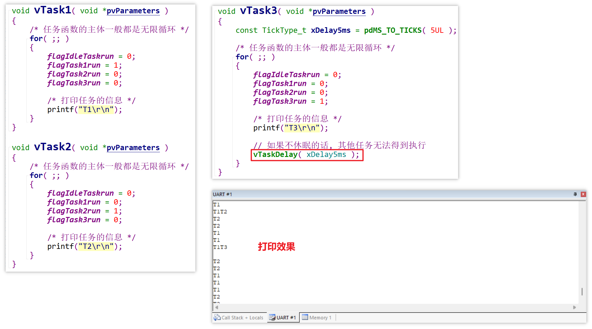

# 07_任务状态的切换

在例程 [main.c](source/11_freertos_example_scheduler/FreeRTOS/Demo/CORTEX_STM32F103_Keil/main.c) 中，创建了 3 个任务，其中 Task3 的任务优先级为 2，Task1 和 Task2 的任务优先级为 0：

在 Task3 中使用了 `vTaskDelay` 延时 5ms 的打印效果：

Task3 不延时的打印效果：

当 Task3 调用 `vTaskDelay` 函数时，Tick 中断会将 Task3 移入 `DelayedTaskList`（延时链表），在 Task3 的 Delay 期间，Task1 和 Task2 有机会运行：

假设 Task3 在 `TickCount` 为 `n` 时开始延时 5 个 Tick，则 `TickCount` 为 `n+5` 时，Task3 将被重新移入 `pxReadyTasksLists[2]` 并获得运行的优先权。

