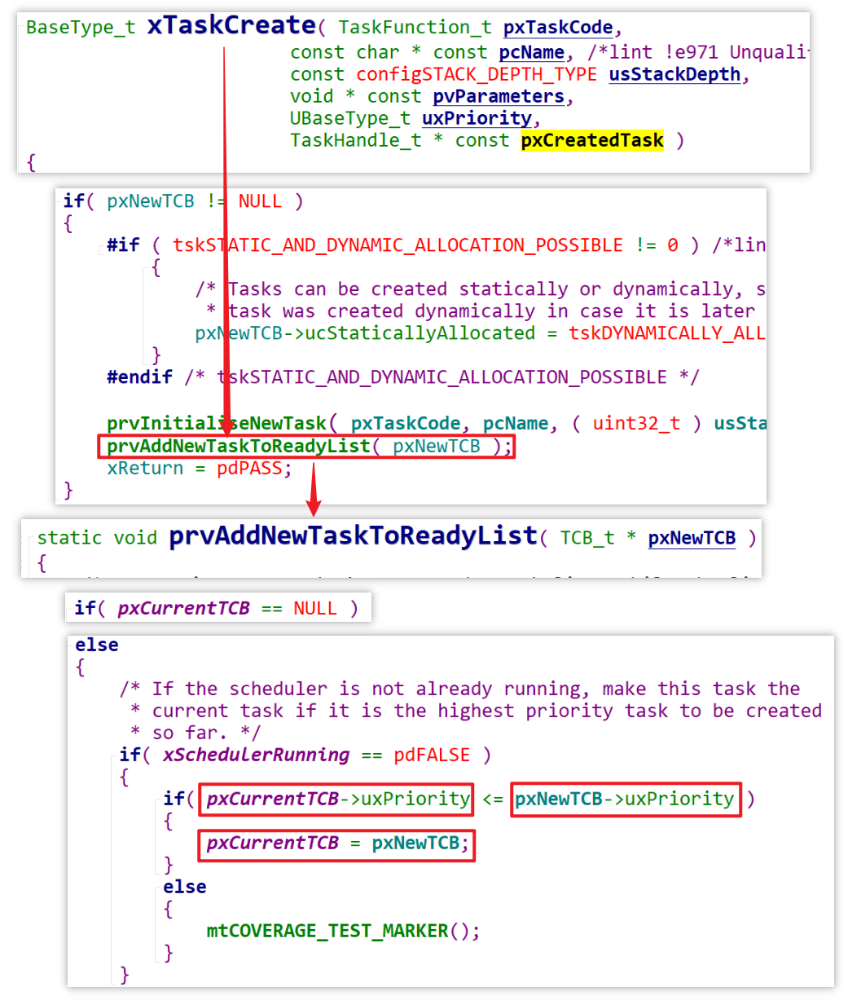
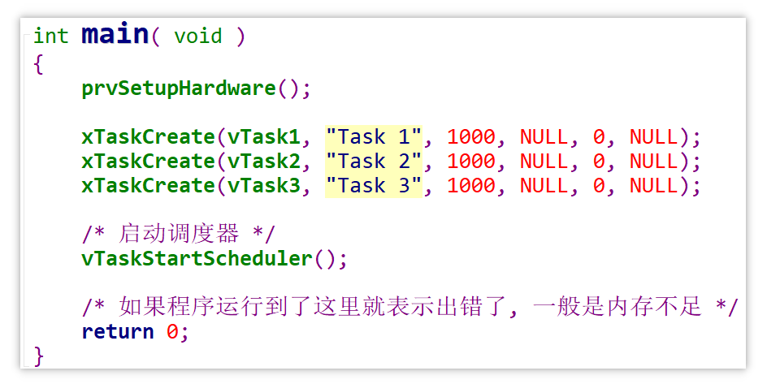
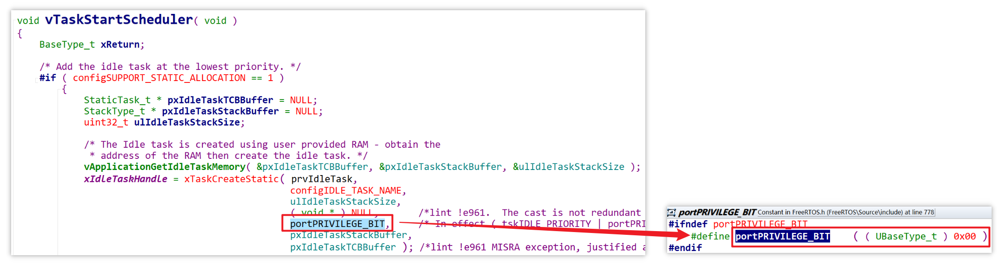
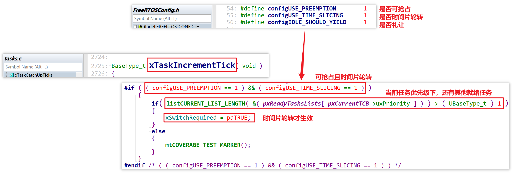
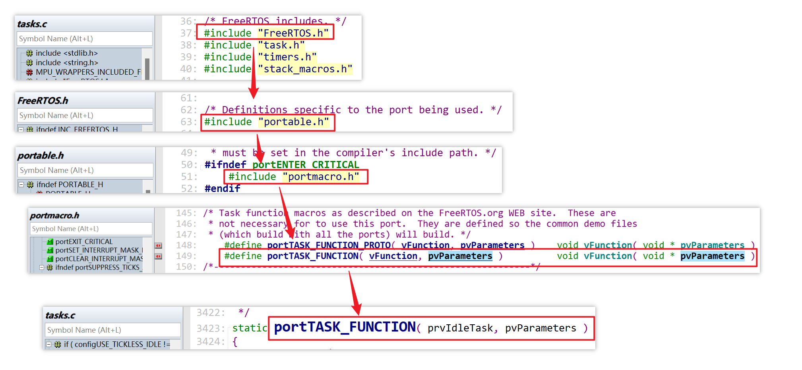
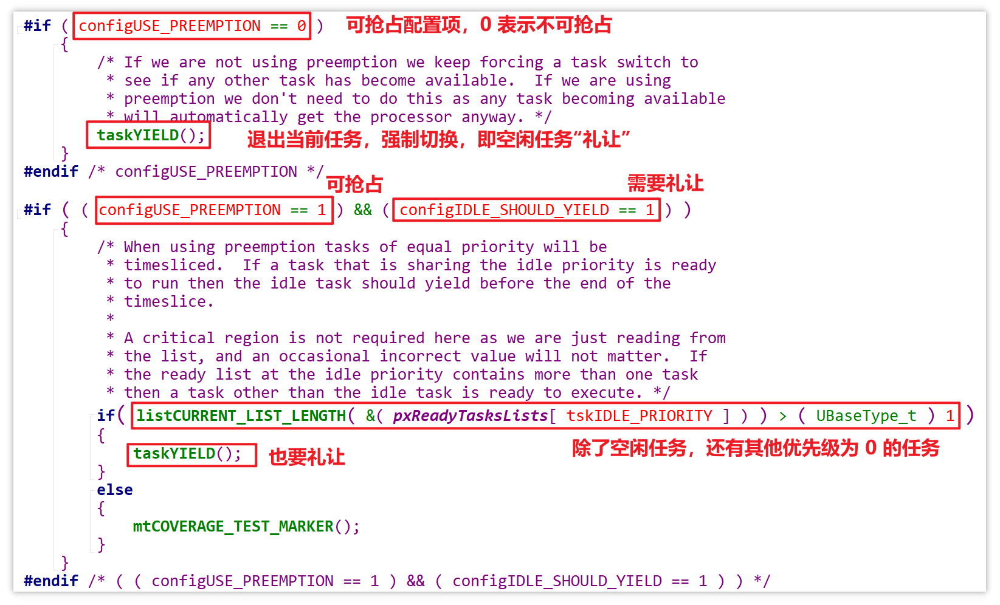

# 08_任务调度深入讨论.md


## 任务运行顺序

1. 假设在启动任务调度器前创建了 3 个任务，它们的优先级都是 0，则启动调度器后谁第一个运行？

   根据下图，创建任务时会调用 `prvAddNewTaskToReadyList` 函数，该函数不仅将新创建的任务放入就绪链表数组 `ReadyTasksLists` 中，还会比较当前任务优先级（`pxCurrentTCB->uxPriority`）与新建任务优先级（`pxNewTCB->uxPriority`），若新建任务优先级大于或等于当前任务优先级，则将当前任务切换为新建的任务。

   

   注意此时尚未启动调度器，仅仅是创建了 3 个优先级为 0 的任务：

   

   按照前面的分析，当第 3 个任务被创建，当前任务就被切换为 3 个任务，一旦调度器被启动，第 3 个任务将首先运行。

   但实际上并非如此，在任务调度器启动前，有一个空闲任务会被创建，其优先级也是 0，与当前任务（第 3 个任务）相当，因此当前任务会被切换为空闲任务。

   当任务调度器真正启动后，该空闲任务将会第一个得到执行：

   

1. 假设创建的 3 个任务，它们的优先级都是 1，谁第一个运行？

   此时任务调度器启动前，最高优先级且最新被创建的任务是第 3 个任务，因此第 3 个任务首先运行。

1. 什么情况下，任务会在下一个Tick中断到达之前，中途就放弃运行？

   假设 Task1 正在运行，有以下两类情况，会在下一个 Tick 中断发生之前就放弃运行：

   - 主动放弃
     - `vTaskDelay`，阻塞
     - 读队列，读不到，阻塞
     - 等等
   - 被动放弃
     - 发生了一个 GPIO 按键中断，将某个数据写入了某个队列，唤醒了另一个更高优先级的任务，马上被抢占
     - 等等


## 深入理解调度机制

- 可抢占：高优先级的任务抢占运行
- 时间片轮转：同等优先级的任务轮流运行
- 空闲任务礼让：如果有优先级为 0 的其它就绪任务，空闲任务主动放弃一次运行机会


### 时间片轮转的前提条件

从下图可看出，任务时间片轮转的前提是可抢占：




### 什么是空闲任务礼让？

空闲任务函数的定义位于 `tasks.c`：

```c
static portTASK_FUNCTION( prvIdleTask, pvParameters )
```

该是通过 `portmacro.h` 中的宏来定义的：



该函数的主要结构：

```c
static portTASK_FUNCTION( prvIdleTask, pvParameters )  //static void prvIdleTask(void * pvParameters)
{
    ( void ) pvParameters;  // 表示空闲任务没有使用参数

    portALLOCATE_SECURE_CONTEXT( configMINIMAL_SECURE_STACK_SIZE );  // 分配安全上下文

    /* 空闲任务的主要操作 */
    for( ; ; )
    {
        prvCheckTasksWaitingTermination();  // 检查是否有任务已完成并等待被终止	

        #if ( configUSE_PREEMPTION == 0 )   // 配置为不可抢占的情况（非抢占模式）
            {
                 taskYIELD();  // 空闲任务礼让：强制执行任务切换，看看是否有其它任务就绪
            }
        #endif /* configUSE_PREEMPTION */

        #if ( ( configUSE_PREEMPTION == 1 ) && ( configIDLE_SHOULD_YIELD == 1 ) )  // 配置为可抢占且需要礼让
            {
                if( listCURRENT_LIST_LENGTH( &( pxReadyTasksLists[ tskIDLE_PRIORITY ] ) ) > ( UBaseType_t ) 1 )
                {
                    // 如果空闲任务所在链表的链表项数大于 1（即除了空闲任务，还有其他优先级为 0 的任务），则空闲任务礼让
                    taskYIELD();
                }
                else
                {
                    mtCOVERAGE_TEST_MARKER();
                }
            }
        #endif /* ( ( configUSE_PREEMPTION == 1 ) && ( configIDLE_SHOULD_YIELD == 1 ) ) */

        #if ( configUSE_IDLE_HOOK == 1 )
            {
                extern void vApplicationIdleHook( void );
                // 调用钩子函数
                vApplicationIdleHook();
            }
        #endif /* configUSE_IDLE_HOOK */

        #if ( configUSE_TICKLESS_IDLE != 0 )  // 低功耗管理
            {
                TickType_t xExpectedIdleTime;

                xExpectedIdleTime = prvGetExpectedIdleTime();

                if( xExpectedIdleTime >= configEXPECTED_IDLE_TIME_BEFORE_SLEEP )
                {
                    vTaskSuspendAll();
                    {
                        configASSERT( xNextTaskUnblockTime >= xTickCount );
                        xExpectedIdleTime = prvGetExpectedIdleTime();

                        configPRE_SUPPRESS_TICKS_AND_SLEEP_PROCESSING( xExpectedIdleTime );

                        if( xExpectedIdleTime >= configEXPECTED_IDLE_TIME_BEFORE_SLEEP )
                        {
                            traceLOW_POWER_IDLE_BEGIN();
                            portSUPPRESS_TICKS_AND_SLEEP( xExpectedIdleTime );
                            traceLOW_POWER_IDLE_END();
                        }
                        else
                        {
                            mtCOVERAGE_TEST_MARKER();
                        }
                    }
                    ( void ) xTaskResumeAll();
                }
                else
                {
                    mtCOVERAGE_TEST_MARKER();
                }
            }
        #endif /* configUSE_TICKLESS_IDLE */
    }
}
```

其中关于空闲任务礼让的部分：

- 如果配置为非抢占模式，必定礼让
- 如果配置为可抢占模式且需要礼让，当存在其他优先级为 0 的就绪任务时，礼让




### 可能发生的情况

假设按 Task1、Task2... 的顺序创建了多个优先级为 0 的任务，且这些任务处于就绪态，启动调度器后

- 当配置为不可抢占
  - 空闲任务运行了一小会儿就退出（礼让），切换为 Task1 运行
  - 由于非抢占模式下时间片轮转不生效，Task1 将永远运行，不会切换为 Task2
- 当配置为可抢占
  - `configIDLE_SHOULD_YIELD` 配置为 1，空闲任务需要礼让，切换为 Task1 运行
    - `configUSE_TIME_SLICING` 配置为 1，Task1、Task2... 时间片轮转
    - `configUSE_TIME_SLICING` 配置为 0，Task1 永远运行，除非主动放弃
  - `configIDLE_SHOULD_YIELD` 配置为 0，空闲任务不礼让，执行 1 个 Tick 之后切换为 Task1 运行
    - `configUSE_TIME_SLICING` 配置为 1，Task1、Task2... 时间片轮转
    - `configUSE_TIME_SLICING` 配置为 0，Task1 永远运行，除非主动放弃