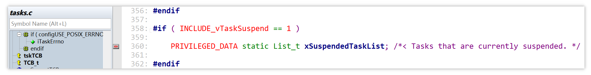

# 09_回顾调度链表

## FreeRTOS 如何实现任务调度？

FreeRTOS 通过以下三类链表管理任务：

- `pxReadyTasksLists`
  - `pxReadyTasksLists `是由链表组成的数组，有多少个优先级，该数组里就有多少个链表
  - 某个任务优先级为 n，就放入该链表数组的第 n 项，n 越大优先级越高
  - Tick 中断中，调度器从数组中下标最大项向第 0 项检索，直到检索到某项链表中存在任务，执行该任务
- `pxDelayedTaskList`
  - 当某个任务被阻塞，将从 `pxReadyTasksLists`数组中的某个链表里被移到 `pxDelayedTaskList`
- `xSuspendedTaskList`
  - 当某个任务被挂起，将移到 `xSuspendedTaskList`，只能手动移出该链表

除此之外，还有一个 `xPendingReadyList `链表：

- 在调度器被停止时（如调用了 `vTaskSuspendAll` 调度锁关闭函数，禁止调度器调用，相当于将所有任务挂起），有些任务进入就绪状态，无法放入 ReadyList 中，就会被放到这里

- 当调度器重新启动时（如调用了 `xTaskResumeAll` 调度锁开启函数，恢复调度器调用），该链表中的任务就会重新插入到对应的 ReadyList

  > `vTaskSuspendAll` 和 `xTaskResumeAll` 函数可以配合使用，适用于临界区太长而不适合简单地关中断的代码段中
  >
  > [FreeRTOS原理剖析：任务挂起和恢复_xpendingreadylist-CSDN博客](https://blog.csdn.net/qq_31782183/article/details/101748189)
  >
  > [FreeRTOS任务调度之运行、就绪、阻塞、挂起表_xpendingreadylist-CSDN博客](https://blog.csdn.net/H542723151/article/details/85092086)

上述涉及的链表如下：

