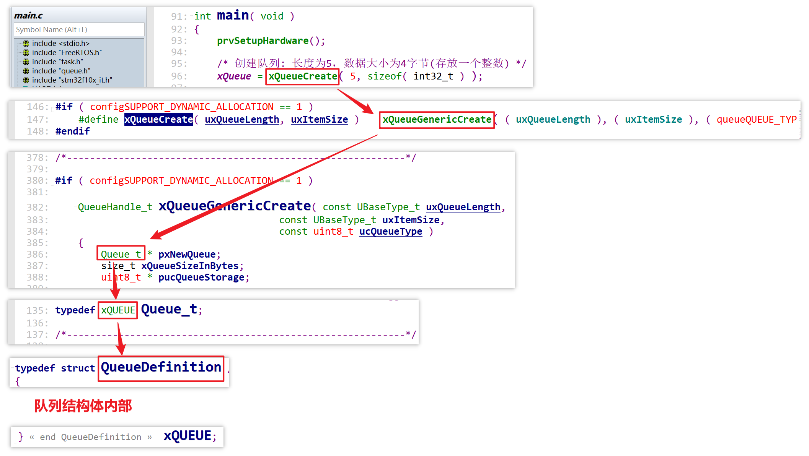
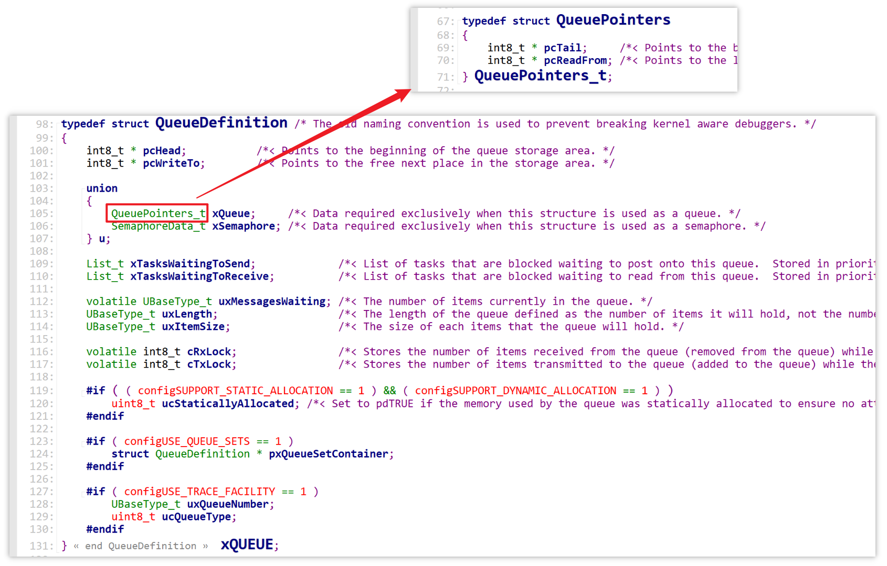
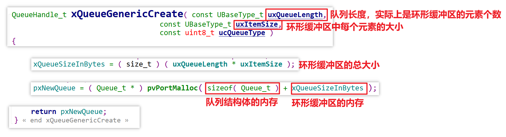
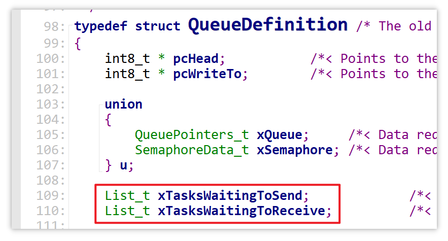
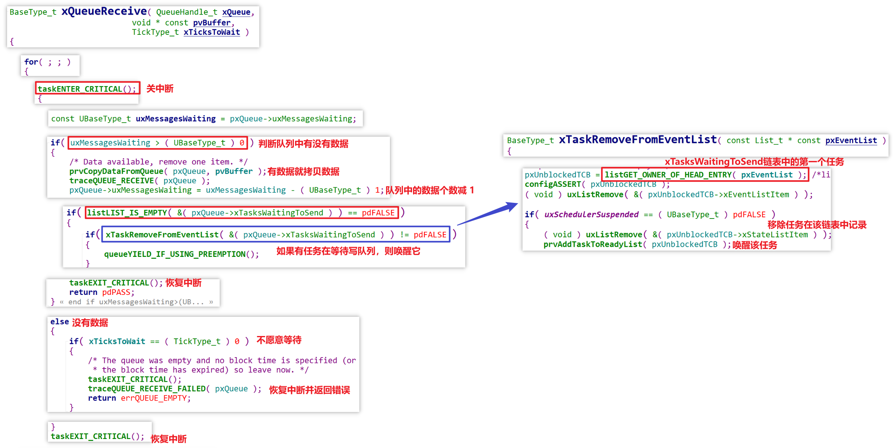
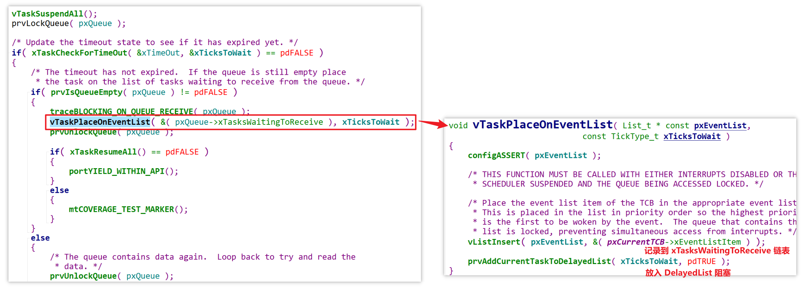
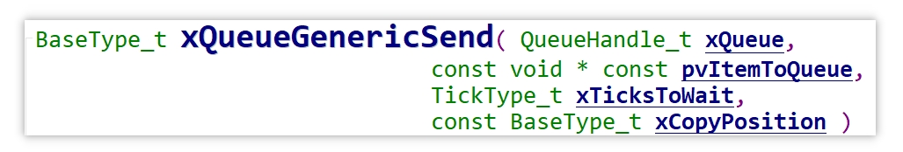
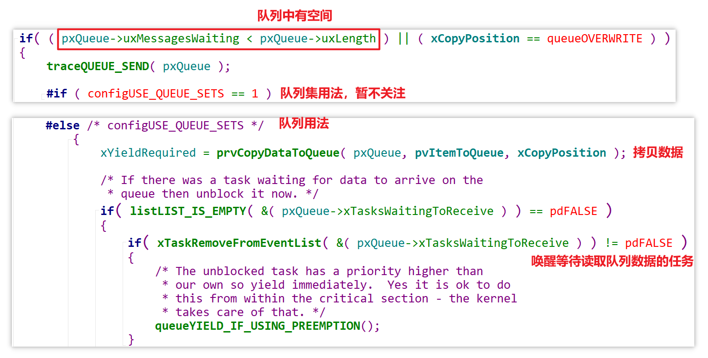
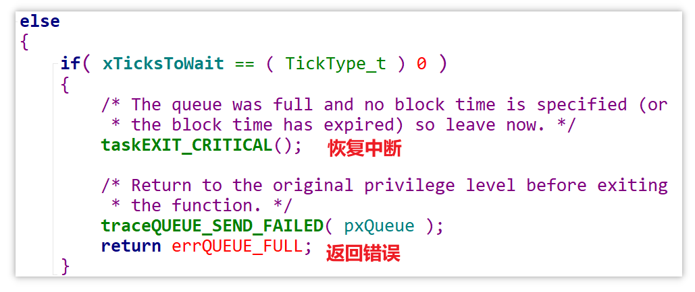
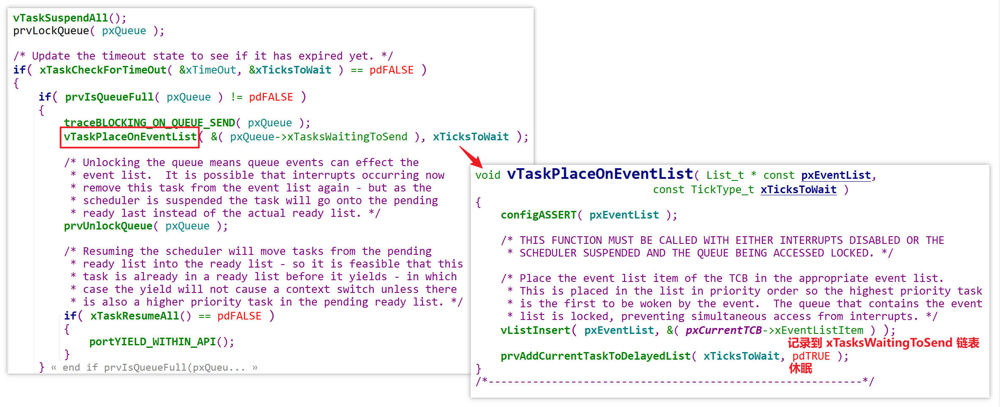

# 14_队列结构体及读流程


队列中其实有两个链表

- 一个是 `list for Receive`

  当队列空的时候，尝试**读队列**的任务会将自己挂在这个链表中，等待被唤醒

- 一个是 `list for Send`

  当队列满的时候，尝试**写队列**的任务会将自己挂在这个链表中，等待被唤醒


## 源码分析

[FreeRTOS_08_queue](source/FreeRTOS_08_queue) 

### 队列结构体

通过以下路径找到队列结构体：



队列结构体内部：



队列结构体 `Queue_t` 本身并不存储数据，而是通过存储环形缓冲区读写位置的指针，真正的数据存储在一个附属的环形缓冲区中，这个环形缓冲区在内存中的位置紧跟在队列结构体后面：

- 上图中，队列结构体里面的 `pcWriteTo` 和 `pcReadFrom` 就是环形缓冲区的读写位置指针
- 其中 `pcReadFrom` 在一个联合体 `u` 中
- 队列结构体可以认为是这个队列的头部，附属的环形缓冲区才是真正的数据区

也就是说，创建一个队列时，要分配的内存包括队列结构体以及附属的环形缓冲区，具体分配的内存大小：

- 队列结构体 `Queue_t` 本身的大小（固定）
- 附属环形缓冲区的大小（可变）由用户指定



除此之外，队列结构体中的 `xTasksWaitingToSend` 和 `xTasksWaitingToReceive` 这两个链表，就是开头所说的那两个链表的具体定义：



### 读队列

读队列函数中的流程：

```c
ReceiveQueue()
{
    // 1. 关中断

    // 2. 有数据
    // 2.1 拷贝数据
    // 2.2 唤醒 Queue.xTasksWaitingToSend 中记录的任务（等待队列空出位置以便于写数据的任务）

    // 3. 无数据
    	// 3.1 不想等待就返回 err
    	// 3.2 愿意等待，就休眠
            // 将自己放入 Queue.xTasksWaitingToReceive 链表（仅作记录，便于读队列的任务找到自己并唤醒自己）
            // 将任务从 ReadyTasksLists[] 放入 DelayedTaskList（真正休眠）
}
```

队列中有数据或无数据但不愿意等待的情况：



队列中无数据但愿意等待的情况：



### 写队列

```c
xQueueSend()
{
    // 1. 关中断
    
    // 2. 有空间写
        // 2.1 写数据
        // 2.2 唤醒 Queue.xTasksWaitingToReceive 中记录的任务（等待读队列而阻塞的任务）
    
    // 3. 无空间写
        // 3.1 不想等待就返回 err
        // 3.2 愿意等待，就休眠
            // 将自己放入 Queue.xTasksWaitingToSend 链表中（仅作记录，便于读队列的任务找到自己并唤醒自己）
            // 将任务从 ReadyTasksLists[] 放入 DelayedTaskList（真正休眠）
}
```

写队列函数：



首先进入循环就关中断：


有空间写队列时：



没有空间但不愿意等待时：



没有空间但愿意等待：


