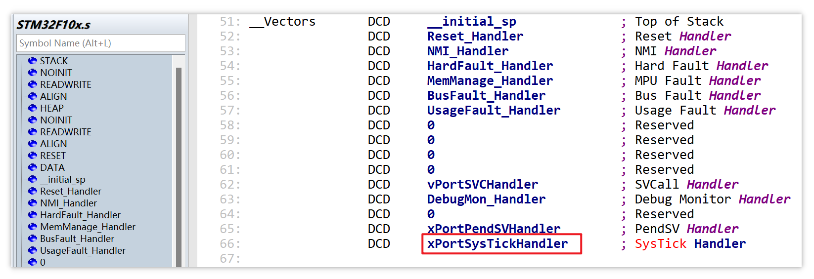
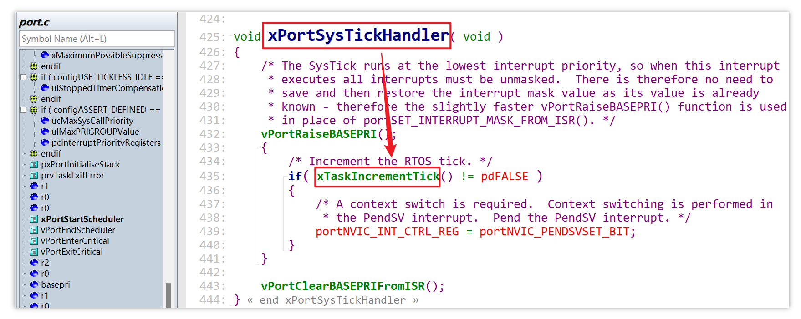
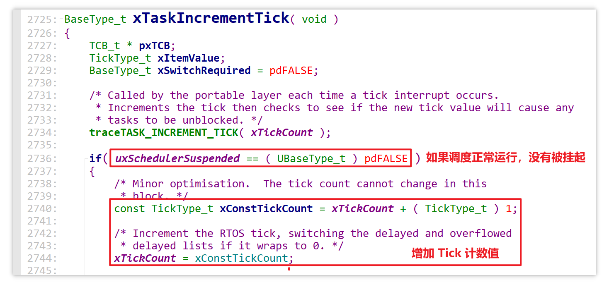
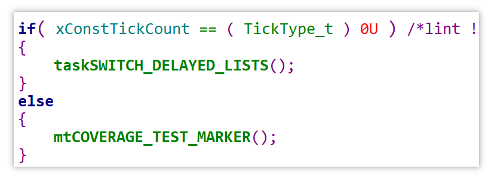
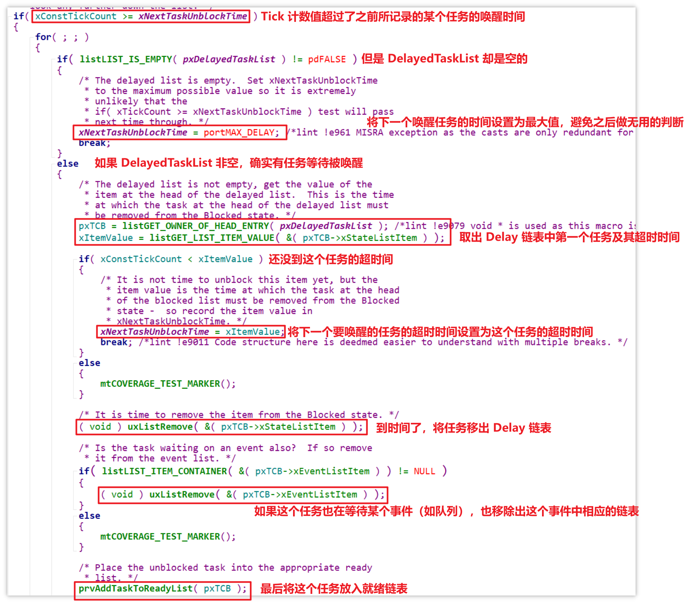

# 16_队列的超时唤醒

系统中断处理函数在汇编文件 `STM32F10x.s` 中的中断向量表可以找到：

该函数的具体定义在 `port.c`，其核心实现是 `xTaskIncrementTick` 函数：

在 `xTaskIncrementTick` 函数中，如果调度器正常运作，没有被挂起，那么首先增加 Tick 的计数值：

Tick 计数值溢出处理：调用 `taskSWITCH_DELAYED_LISTS` 函数切换延迟任务链表，确保系统正确处理延迟任务

具体的超时唤醒操作：

如果 Delay 链表中有读写队列的任务到期了，除了将该任务移出 Delay 链表（下图中的 `pxTCB->xStateListItem`），还要将该任务移出对应队列的 `xTasksWaitingToSend` 或 `xTasksWaitingToReceive` 链表（也就是下图中的 `pxTCB->xEventListItem`）

