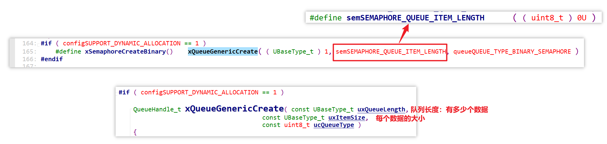

# 18_信号量操作流程和代码分析

以二进制信号量为例的源码分析： [FreeRTOS_12_semaphore_binary](source/FreeRTOS_12_semaphore_binary) 

## 创建信号量

`xSemaphoreCreateBinary` 函数创建二进制信号量的返回值为信号量句柄：

实际上信号量内部是用队列来实现的，所谓创建信号量，其实是创建了一个队列。

在这个特殊的队列中，有一个数据，但这个数据的大小是 0。这意味着，这个特殊的队列并没有分配附属的环形缓冲区，只分配了一个队列头（队列结构体）。

这也意味着，**信号量的计数值必然是在队列的头部进行管理的**。

## 释放信号量

释放信号量调用到 `xSemaphoreGive` 函数：

实际上这就是个写队列的函数，并且超时时间为 0，表示如果释放信号量（写对列）不成功，立刻返回，不等待：

在 `xQueueGenericSend` 中，for 循环里首先关中断，然后就是一个条件判断：

只有当 `uxMessagesWaiting` 小于 `uxLendth` 才会走 if 分支

以下是对 `pxQueue` 结构体中 `uxMessagesWaiting` 和 `uxLength` 的解释，释放信号量的后续流程在[此处跳转](#anchor-1)

通过查看 `Queue` 结构体，知道 `uxMessagesWaiting` 表示队列中当前还有多少个数据，`uxLength` 则表示定义队列时，为队列分配了多少个数据的空间：

那么在创建二进制信号量时，指定的 `uxLength` 就是 1，表示队列中最多能放 1 个数据：

因此对于二进制信号量的队列，`uxMessagesWaiting` 的值就只能是 0 或 1，即队列中可能没有数据或只有一个数据。

但这个队列中的数据其实并不存在，因为创建二进制信号量时，为信号量的队列设置的 `uxItemSize` 为 0，没有为队列分配环形缓冲区来存放实际的数据。

总结起来就是：

- 二进制信号量的队列只有头部（队列结构体 `Queue_t`），没有环形缓冲区存放实际的数据
- `Queue_t` 中的 **`uxMessagesWaiting`** 是用来表示队列中当前存在多少个数据，对于二进制信号量，这个成员则**表示信号量的计数值**
- `Queue_t` 中的 **`uxLength`** 用来表示队列最多可以存放多少个数据（也就是附属环形缓冲区可以存放多少个数据），对于二进制信号量，**这个成员则表示信号量的最大计数值**

继续回到释放信号量的流程分析：

在判断信号量的当前计数值小于最大计数值后，才能走 if 分支，增加计数值（释放信号量）：[具体是如何增加计数值的](#anchor-2)

而如果信号量当前计数值达到了最大计数值，无法释放信号量，就会走 else 分支：如果不愿意等待，就直接返回错误

如果愿意等待，就继续向下走，判断是否超时：

回头细看 if 分支是如何增加计数值的：

- 调用 `prvCopyDataToQueue`

  - 对于一般的写队列，`prvCopyDataToQueue` 会将数据写入队列的附属环形缓冲区，然后让 `uxMessagesWaiting` 加 1，表示队列中多了一个数据

  - 对于信号量，`prvCopyDataToQueue` 只会让 `uxMessagesWaiting` 加 1，表示计数值加 1

- 然后判断是否有任务在等着读这个队列，或等着获取信号量
  - 如果有，就调用 `xTaskRemoveFromEventList` 将它从队列头部（结构体 `Queue_t`）中的 `xTasksWaitingToReceive` 链表中移除
  - 除此之外，`xTaskRemoveFromEventList` 函数内部还会将它放入 ReadyList，即唤醒它

## 获取信号量

获取信号量调用到 `xSemaphoreTake` 函数：

从名称也可以看出来，这个获取信号量的函数也是使用队列来实现的：

函数内部也是先关中断，获得当前计数值，然后分为以下几个分支：

如果计数值大于 0，可获取信号量：

- 让计数值 -1
- 唤醒等待释放信号量的任务（如果有的话）
  - 如果有的任务想要释放信号量，但是信号量计数值已经达到最大，就会被记录到队列头部（队列结构体 `pxQueue`）的 `xTasksWaitingToSend` 链表中，并且被放入 DelayedList 中阻塞
  - `xTaskRemoveFromEventList` 会将这样的任务从 `xTasksWaitingToSend` 中移出，并且放到 ReadyList 中（唤醒）

如果计数值为 0，无法获得信号量，而且不愿意等待，就直接返回错误：

如果愿意等待，但还没超时：

如果超时了：

