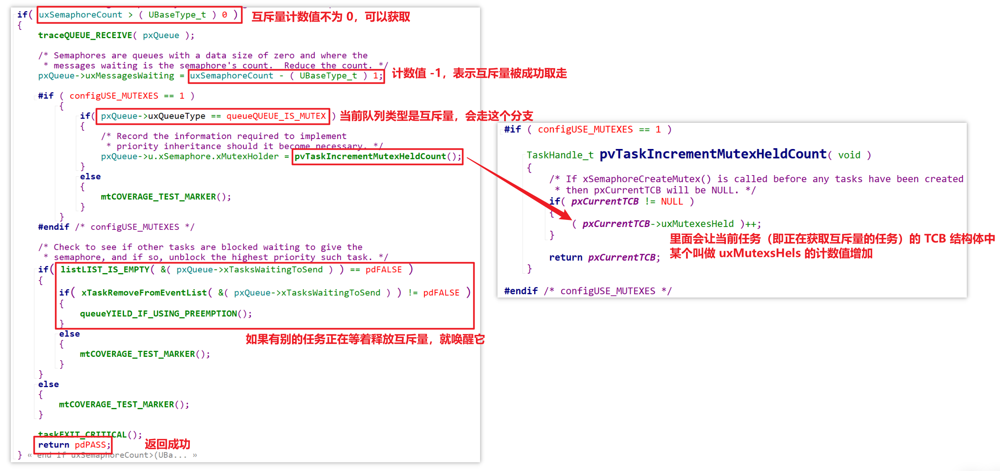
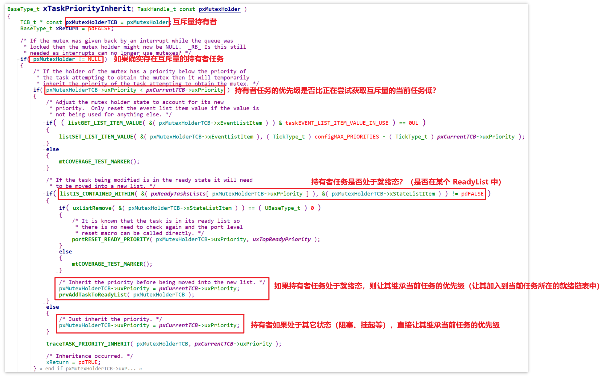

# 20_互斥量源码分析

源码： [FreeRTOS_15_mutex](source/FreeRTOS_15_mutex) 

## 创建互斥量

调用 `xSemaphoreCreateMutex` 函数创建互斥量：

互斥量和信号量一样，是特殊的队列，也将队列容量设置为 1，但 `uxItemSize` 为 0，不分配环形缓冲区来存储实际数据：

因此互斥量和信号量一样是使用队列头（队列结构体 `Queue_t`）中的计数值来进行管理。

另外需要注意的是，`xQueueCreateMutex` 传入了一个参数 `queueQUEUE_TYPE_MUTEX`，这个参数使得互斥量释放与获取的流程比信号量多了一些动作。

## 获得互斥量

和信号量一样也是调用 `xSemaphoreTake` 函数：

由于互斥量和信号量使用同一套函数，因此也是按照以下四种情况来处理流程：

首先也是先关中断，然后如果计数值不为 0，说明互斥量可以获取，那么就会有以下动作：

- 减少互斥量的计数值（从 1 减到 0），表示取走互斥量
- 与信号量不同的是，互斥量还会进入 `pxQueue->uxQueueType == queueQUEUE_IS_MUTEX` 的分支，减少某个叫做 `uxMutexsHeld` 的计数值
- 和信号量一样，也会唤醒其它正在等着释放互斥量（信号量）的任务，然后返回成功

那么这个叫做 `uxMutexsHeld` 的计数值是什么东西？[跳转获取互斥量后续流程](#anchor-1)

进入 TCB 结构体，注意到对于使用互斥量的任务来说，还会用到两个属性，一个是 `uxBasePriority`，另一个是 `uxMutexsHeld`：

`uxBasePriority` 非常好理解，注释中说明这是该任务的基本优先级（创建该任务时赋予它的优先级），将来该任务继承其它任务的更高优先级后，需要恢复原本自己的优先级时，就会用到这个 `uxBasePriority` 来进行优先级的还原操作。

而 `uxMutexsHeld` 属性，推测是一个标志，如果该任务获得了一个互斥量，就会让此标记增加 1。

回到获取互斥量的流程中，如果无法获得信号量，并且当前任务传入的超时时间为 0（不愿意等待），那么就马上返回错误：

如果当前任务愿意等待互斥量，那么就会调用 `xTaskPriorityInherit` 函数进行优先级继承的操作：

具体的优先级继承操作：

继续回到获取互斥量的流程，超时则返回：

## 释放互斥量

和信号量一样，调用 `xSemaphoreGive` 函数：

因此和信号量一样，释放互斥量是不会等待的：

由于释放互斥量和信号量用的是同一套 API，相同的操作不再重复说明，以下是释放互斥量的流程中，对比释放信号量新增的动作。

如果互斥量计数值为 0，就会调用 `prvCopyDataToQueue`，但互斥量不会真的拷贝数据，而是解除优先级继承，然后再让计数值加 1：

具体是如何解除优先级继承的：

