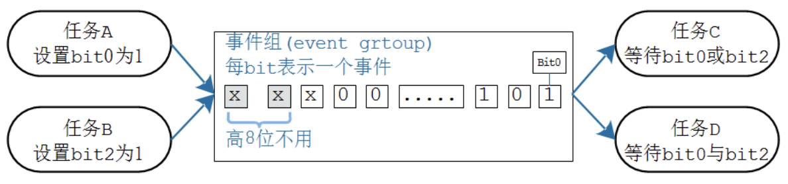
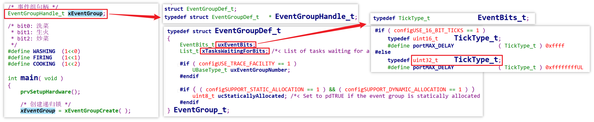

# 21_事件组（event_group）内部机制

任务 A 和任务 B 设置 bit 事件永远不阻塞，任务 C 和任务 D 等待 bit 事件时可以设置阻塞时间。 

源码： [FreeRTOS_20_event_group_wait_multi_events](source/FreeRTOS_20_event_group_wait_multi_events) 

## 事件组结构体

事件组结构体 `EventGroup_t` 中，只有两个成员需要注意：

- `uxEventBits`：整型，里面每一位都可以表示一个事件
- `xTasksWaitingForBits`：链表，里面记录着等待该事件组中某一些事件的任务

事件组和队列不同，只有一个链表，这是因为设置 bit 事件的任务不会阻塞，只有等待 bit 事件的任务才设置阻塞时间。

## 事件组的使用流程

1. 创建事件组

2. 等待事件组

   - 需要传入的关键参数：

     - 等待哪个事件组？
     - 等待事件组里的哪些事件（bits）？
     - 如果满足了等待条件（等到了想要的事件组合），那么退出等待函数之前，是否要把这些事件 bit 位清除？
     - 等待这些事件都发生，还是等待其中一个事件发生（与/或的关系）？
     - 超时时间？还没满足条件，愿意等待多久？

   - 内部流程：

     - 通过**关闭调度器**实现互斥，并**不关中断**，为什么？

       - 队列（信号量、互斥量也算特殊队列）通过关中断来实现互斥，既能屏蔽任务，也能屏蔽中断

         当队列进入临界区，其它任务无法调度，中断也无法发生，任务和中断都无法影响当前任务读写队列，因此除了任务可以使用队列，中断也可以使用队列

       - 事件组只关闭调度器，只能屏蔽其它任务的调度，无法屏蔽中断，也说明了**中断不能使用事件组**

     - 当前 `uxEventBits` 是否满足条件？

       - 满足
       - 不满足
         - 不愿意等待，直接返回 err
         - 愿意等待，休眠：
           - 将当前任务放入 `EventGroup_t.xTasksWaitingForBits` 链表（记录，便于找回）
           - 将当前任务放入 `DelayedList`（真正的休眠操作）

3. 设置事件组：

   - 设置 bit 事件
   - 唤醒 `EventGroup_t.xTasksWaitingForBits` 链表上**所有满足条件**的任务
