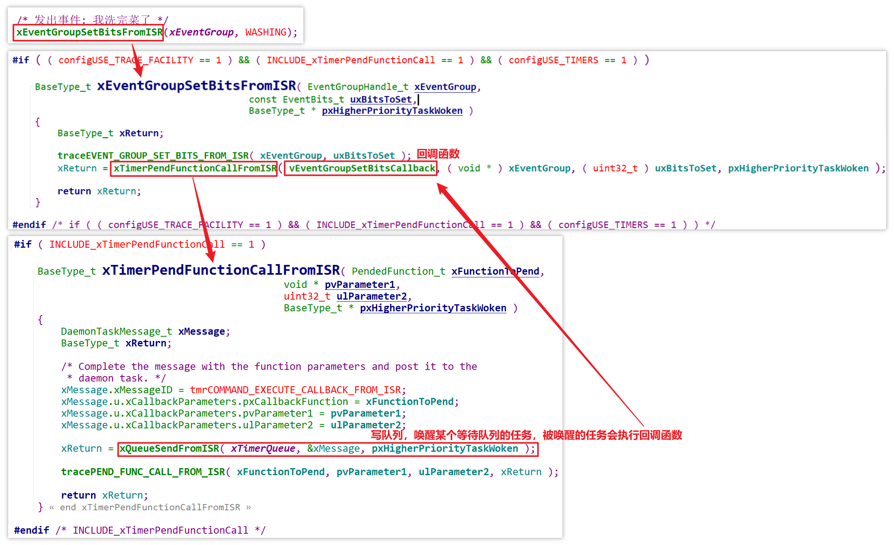
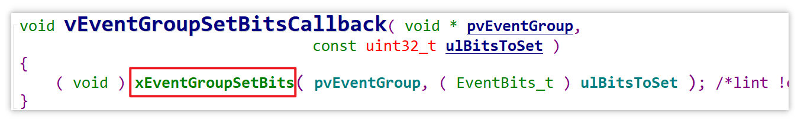

# 22_事件组为什么不关中断


需要注意，无法在中断里等待事件组，等待事件组的函数只有一套，适用于任务：

```c
EventBits_t xEventGroupWaitBits( EventGroupHandle_t xEventGroup,
                                 const EventBits_t uxBitsToWaitFor,
                                 const BaseType_t xClearOnExit,
                                 const BaseType_t xWaitForAllBits,
                                 TickType_t xTicksToWait );
```

而设置事件组有两套函数，除了可以在任务里设置事件组（发送事件），也可以在中断里设置事件组：

```c
/* 设置事件组中的位
 * xEventGroup: 哪个事件组
 * uxBitsToSet: 设置哪些位? 
 *              如果uxBitsToSet的bitX, bitY为1, 那么事件组中的bitX, bitY被设置为1
 *              可以用来设置多个位，比如 0x15 就表示设置bit4, bit2, bit0
 * 返回值: 返回原来的事件值(没什么意义, 因为很可能已经被其他任务修改了)
 */
EventBits_t xEventGroupSetBits( EventGroupHandle_t xEventGroup,
                                    const EventBits_t uxBitsToSet );

/* 设置事件组中的位
 * xEventGroup: 哪个事件组
 * uxBitsToSet: 设置哪些位? 
 *              如果uxBitsToSet的bitX, bitY为1, 那么事件组中的bitX, bitY被设置为1
 *              可以用来设置多个位，比如 0x15 就表示设置bit4, bit2, bit0
 * pxHigherPriorityTaskWoken: 有没有导致更高优先级的任务进入就绪态? pdTRUE-有, pdFALSE-没有
 * 返回值: pdPASS-成功, pdFALSE-失败
 */
BaseType_t xEventGroupSetBitsFromISR( EventGroupHandle_t xEventGroup,
									  const EventBits_t uxBitsToSet,
									  BaseType_t * pxHigherPriorityTaskWoken );
```

**既然中断里也可以设置事件组，为什么等待事件组的时候不关中断？**源码： [FreeRTOS_20_event_group_wait_multi_events](source/FreeRTOS_20_event_group_wait_multi_events) 

`xEventGroupSetBitsFromISR` 并不会设置 bits 事件，它只会触发/唤醒一个 “守护任务”，由守护任务来设置 bits 事件：



最终依然是在任务的环境下设置 bits 事件：



所以使用事件组的时候，只需要关闭调度器就可以了。

那么问题又来了，**既然想要在中断里设置事件组，为什么要这么弯弯绕绕，通过唤醒一个任务、让任务来设置 bits 事件呢？**

这么做的原因在于，设置事件组时，会唤醒该事件组结构体的链表中所有满足唤醒条件的任务，如果要唤醒的任务太多，那么花费的时间就是不可预测的，RTOS 不允许中断里处理一些时间不确定的事情，中断的处理要越快越好，所以当中断需要设置事件组时，“委托” 一个任务来代理。

