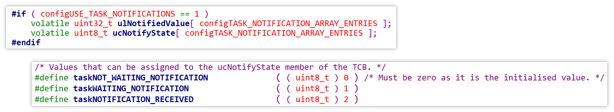

# 任务通知（TaskNotify）内部机制


 源码：[FreeRTOS_23_tasknotify_tansfer_value](source/FreeRTOS_23_tasknotify_tansfer_value) 


使用任务通知和前面的队列、事件组都不同，任务通知是指名道姓的通过任务句柄来通知对方，因此使用任务通知不再需要使用链表。

在任务的 TCB 结构体中，有以下两个属性：

- value：通知值，由任务通知的发送方传递过来，可以表示标志位、计数值、某些事件的状态值等，具体含义由用户决定

- state：状态，是一个数组，可以有三个取值
  - `taskNOT_WAITING_NOTIFICATION`：创建任务时，TCB 结构体中 state 的初始值，表示没有在等待任何其它任务的通知
  - `taskWAITING_NOTIGICATION`：表示正在等待其它任务通知，同时处于休眠状态
  - `taskNOTIFICATION_RECEIVE`：表示接收到了其他任务的通知



根据 state 状态的不同，可能有以下两种时序：

1. 第一种时序
   - t1：taskA 被创建，state 为 `taskNOT_WAITING_NOTIFICATION`
   - t2：taskB 调用 `xTaskNotifyGive` 或 `xTaskNotify `，向 taskA 发送任务通知，将 taskA 的 state 修改为 `taskNOTIFICATION_RECEIVE`
   - t3：taskA 调用 `ulTaskNotifyTake` 或 `xTaskNotifyWait` 函数，想要获得任务通知，由于 taskA 已经获得过 taskB 的任务通知（通过 state 为 `taskNOTIFICATION_RECEIVE` 来判断），taskA 能够直接返回成功，返回之前会把 state 恢复为 `taskNOT_WAITING_NOTIFICATION`
2. 第二种时序
   - t1：taskA 被创建，state 为 `taskNOT_WAITING_NOTIFICATION`
   - t2：taskA 调用 `ulTaskNotifyTake` 或 `xTaskNotifyWait` 函数，想要获得任务通知，将 state 修改为 `taskWAITING_NOTIGICATION`，然后休眠
   - t3：taskB 调用 `xTaskNotifyGive` 或 `xTaskNotify `，向 taskA 发送任务通知，将 taskA 的 state 修改为 `taskNOTIFICATION_RECEIVE`
   - t4：taskA 被唤醒，将 state 恢复为 `taskNOT_WAITING_NOTIFICATION`，然后返回成功

任务通知也是通过关中断操作来实现互斥访问的：

```c
/* 发送通知 */
xTaskNotify()
{
    // 关中断
    
    // 写 value，唤醒另一个任务
    
    // 开中断
}

/* 接收通知 */
xTaskNotifyWait()
{
    // 关中断
    
    // 判断当前状态
    	// 休眠/开中断
    
    // 被唤醒，return
}
```

